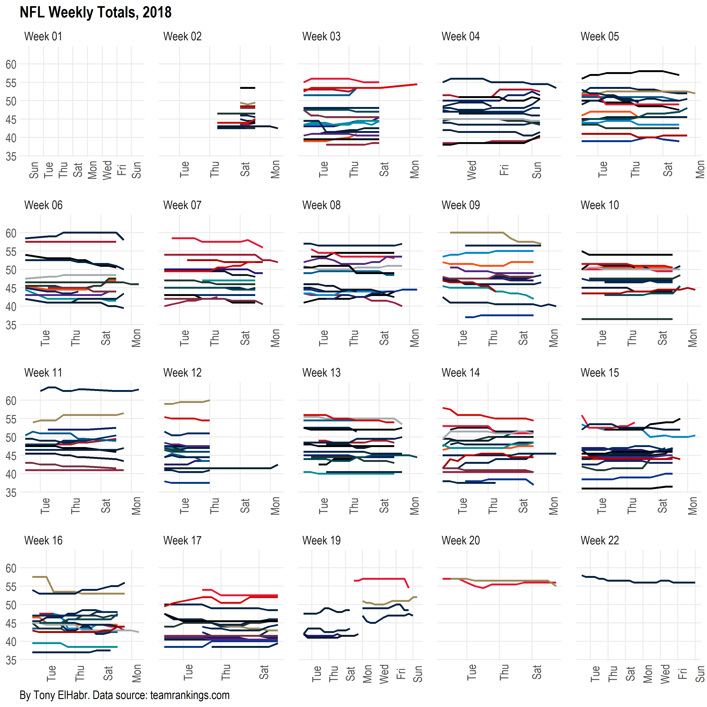

# Introduction

This repo represents my ongoing (and never ending) investigation of 
sports data,
particularly for the NFL and the NBA. I intend to incorporate the work here
in other media formats (e.g. blog posts).

See below to see some of what I have been working on.

# Highlights

Since the beginning of the 2018 NFL and NBA seasons beginning in 2018, I've
been scraping "live" betting information from the teamrankings.com website on a
twice-a-day basis. [^missing] It's well known that sports books change the spreads, totals,
and moneylines that they initially set in real time in order to 
draw action more evenly on both sides of their markers.
Thus, tracking how market behavior changes over time in the lead-up time to a game
can provide a strong basis upon which an individual
can make more informed decisions.

[^missing]:
Be aware that there is some missing data due one of a number of reasons:

    + Bugs in the code
    + Unavailabiltiy of scraper (i.e. user "logged off")
    + Data availability

## NFL

### Weekly Spreads

[Interactive version](http://htmlpreview.github.io/?https://github.com/tonyelhabr/sports-predict/blob/master/figs/viz_odds_nfl_tr_spread.html)

### Weekly Totals

[Interactive version](figs/viz_odds_nfl_tr_total.html)(http://htmlpreview.github.io/?https://github.com/tonyelhabr/sports-predict/blob/master/figs/viz_odds_nfl_tr_total.html)

